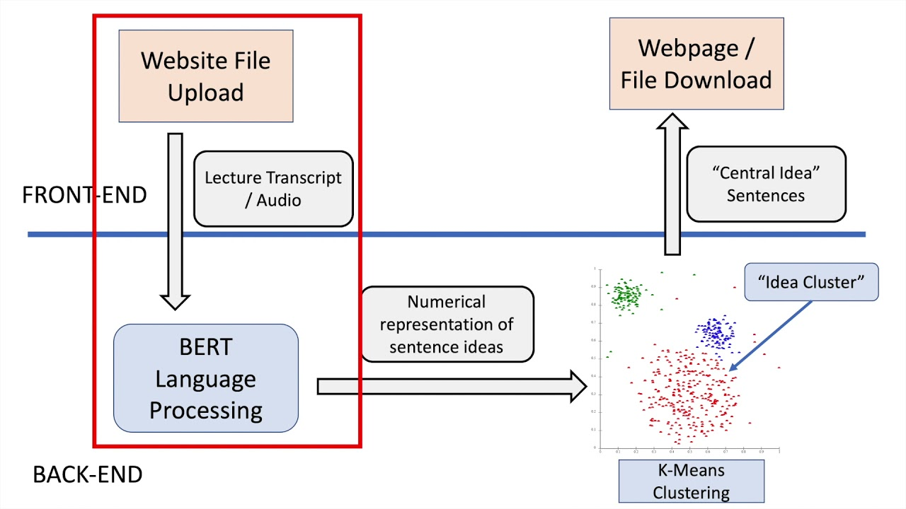

# _What's the Word?_
What’s the Word? is a lecture-notes assistant web app that condenses hefty audio lectures and transcripts into manageable bullet-point summaries. We used tools such as Bidirectional Encoder Representations from Transformers (BERT) to perform natural language processing and convert English sentences into numerical vectors, k-means clustering to find clusters of sentence ideas, Google Cloud's Speech-to-text API, Web Stack, and Flask.



## Run

Clone, install requirements from `requirements.txt`, and from within `web/` run:

```sh
FLASK_APP=app flask run
```